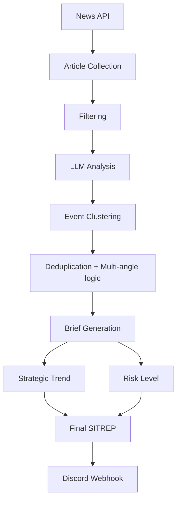

# SITREP Bot


**SITREP** stands for **Situation Report**, a standard military intelligence briefing format used to summarize key developments in a concise and structured way.

---

## Overview

**SITREP Bot** is an automated geopolitical briefing agent that publishes a daily intelligence-style situation report to a Discord channel.

Every morning, the bot analyzes recent global news from reliable international media sources and produces a concise briefing highlighting the most strategically significant geopolitical developments from the past 24 hours.

The output is designed to resemble a **neutral intelligence briefing**, focusing on strategic implications rather than speculation or commentary.

The bot intelligently:

- groups related articles into events  
- avoids duplicate coverage  
- allows multi-angle analysis for major conflicts (military, economic, strategic, diplomatic)

The project is lightweight, configurable, and designed to run automatically with minimal cost.

---

## Features

- Daily automated geopolitical briefing
- Coverage of global geopolitical events (last 24h)
- AI-powered event clustering and deduplication
- Multi-angle analysis for major conflicts
- Concise intelligence-style summaries
- Strategic trend analysis
- Global risk level assessment (score + label)
- Configurable parameters (events, length, etc.)
- Discord webhook integration
- Fully automated via GitHub Actions
- Open-source and lightweight

---

## Example Output

```
🌍 SITREP – March 12, 2026

1️⃣ Ukraine  
Russian forces intensified artillery activity near Kupiansk while Ukrainian forces conducted counter-battery strikes. The escalation suggests continued pressure on northeastern Ukrainian defensive lines.

Sources:
- Reuters

2️⃣ Middle East  
US naval forces intercepted drones launched from Houthi-controlled territory toward shipping lanes in the Red Sea. The attacks continue to threaten maritime trade routes.

Sources:
- BBC

3️⃣ China / Taiwan  
Chinese military aircraft entered Taiwan’s air defense identification zone during new PLA exercises near the island. The maneuvers appear designed to increase pressure ahead of diplomatic engagements.

Sources:
- Financial Times

📈 Strategic Trend  
Maritime security tensions are increasing across several regions, particularly in the Red Sea and the Western Pacific.

⚠ Global Risk Level  
6/10 — Medium
```

---

## Topics Covered

The bot prioritizes:

- geopolitics  
- international relations  
- military activity  
- war and armed conflicts  
- diplomacy  
- international tensions  
- sanctions and alliances  

### Excluded topics

- domestic politics (unless geopolitical relevance)
- crime
- sports
- entertainment
- unrelated economic news

---

## Configuration

The bot behavior is controlled via `config.yaml`:

```yaml
events_per_brief: 5
sentences_per_event: 3
articles_to_scan: 40
article_time_window_hours: 24
timezone: Europe/Paris
briefing_time: "08:00"
risk_scale: "1-10"
allow_duplicate_events: false
```

You can easily adjust:

- number of events  
- summary length  
- number of articles analyzed  
- scheduling  

---

## How It Works

1. Fetch recent articles from news APIs  
2. Filter for geopolitical relevance  
3. Send articles to an LLM  
4. Cluster articles into events  
5. Remove duplicate coverage  
6. Allow multi-angle analysis for major conflicts  
7. Generate summaries  
8. Compute strategic trend and risk level  
9. Send the SITREP to Discord  

---

## Architecture



---

## Running the Bot

### Automatic (recommended)

Runs daily via GitHub Actions:

```
08:00 Europe/Paris
```

### Manual trigger

```
Actions → Run workflow
```

---

## Requirements

- Python 3.10+
- News API key
- OpenAI API key
- Discord webhook

---

## Installation

```bash
git clone https://github.com/yourusername/sitrep-bot.git
cd sitrep-bot
pip install -r requirements.txt
```

---

## Environment Variables

Create a `.env` file (for local use only):

```
OPENAI_API_KEY=your_api_key
NEWS_API_KEY=your_api_key
DISCORD_WEBHOOK_URL=your_webhook
```

⚠️ In production, use **GitHub Secrets instead of `.env`**

---

## Contributing

Contributions are welcome.

Steps:

1. Fork the repo  
2. Create a feature branch  
3. Submit a pull request  

---

## Project Goals

SITREP Bot aims to demonstrate how AI agents can:

- synthesize complex geopolitical data  
- produce structured intelligence briefings  
- automate strategic analysis workflows  

Focus:

- clarity  
- reliability  
- configurability  
- low cost  

---

## License

This project is licensed under the **GNU General Public License v3.0 (GPL-3.0)**.

See the `LICENSE` file for details.
